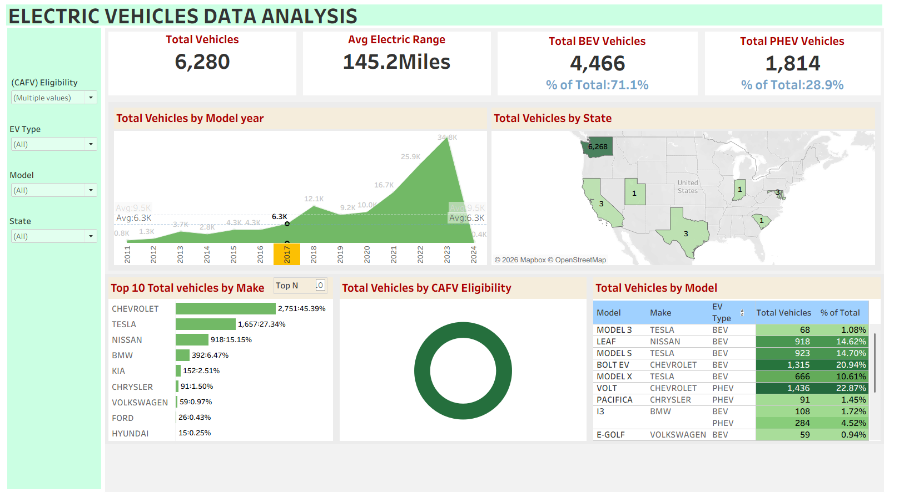

# EV Sales Analysis Dashboard

## Project Overview

This project is an interactive Tableau dashboard that analyzes Electric Vehicle (EV) sales trends, manufacturer performance, vehicle types, and geographic distribution using data visualization.

---

## Dashboard Preview

---

## Key Features

- EV Sales Trend Analysis
- Manufacturer Performance
- Vehicle Type Distribution
- Geographic Analysis
- Interactive Filters
- KPI Dashboard

---

## Tools Used

- Tableau Desktop
- Data Visualization
- Business Intelligence
- Data Analysis

---

## Dataset

The dataset contains information such as:

- Model Year
- Make
- Model
- Electric Vehicle Type
- State
- Electric Range
- Base MSRP

---

---

## Author

Mufliha CH
